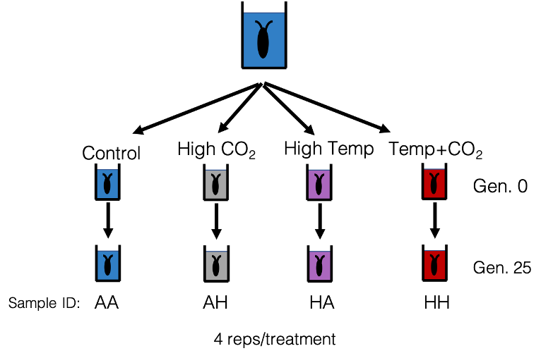
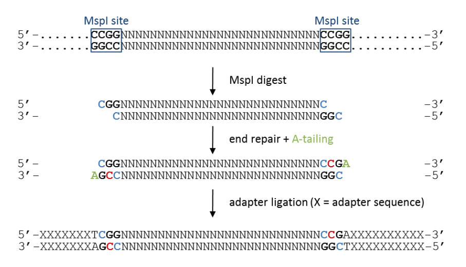
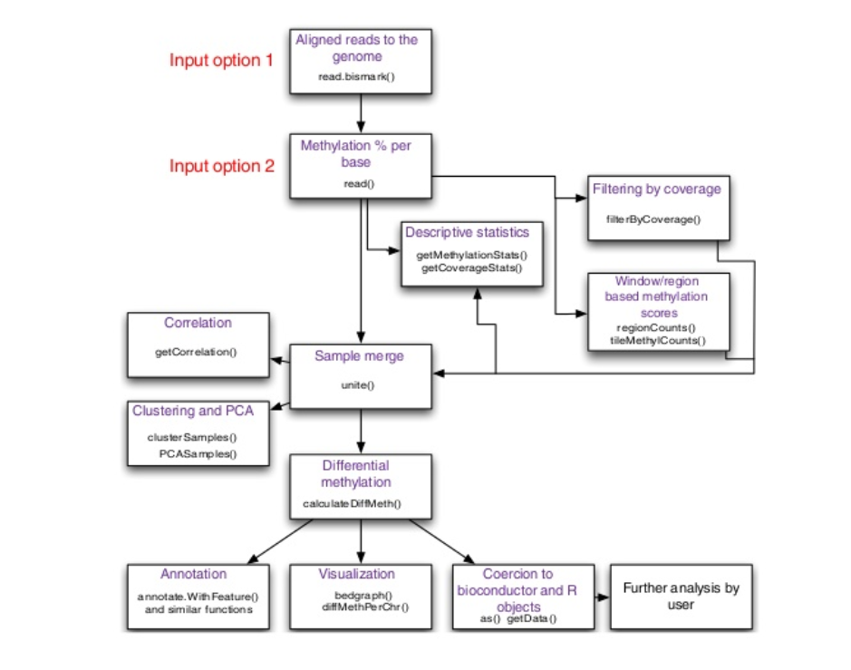
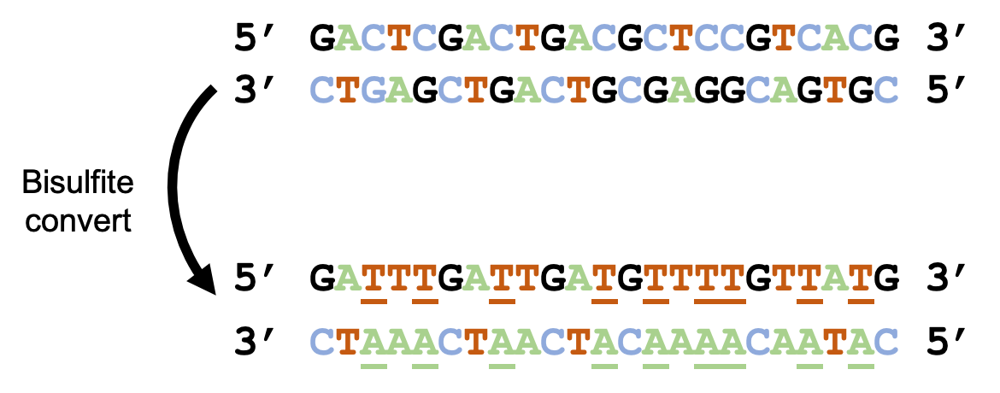
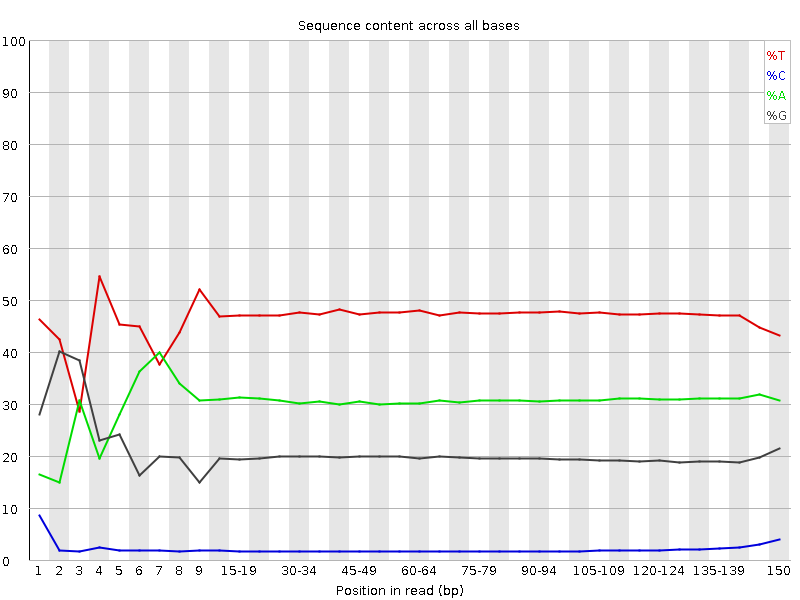
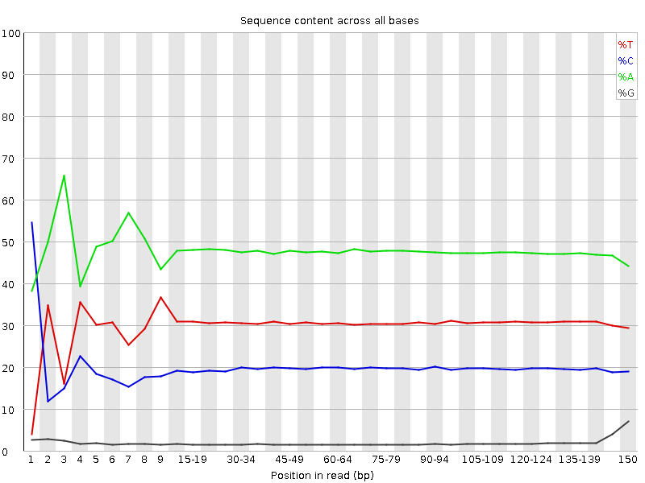
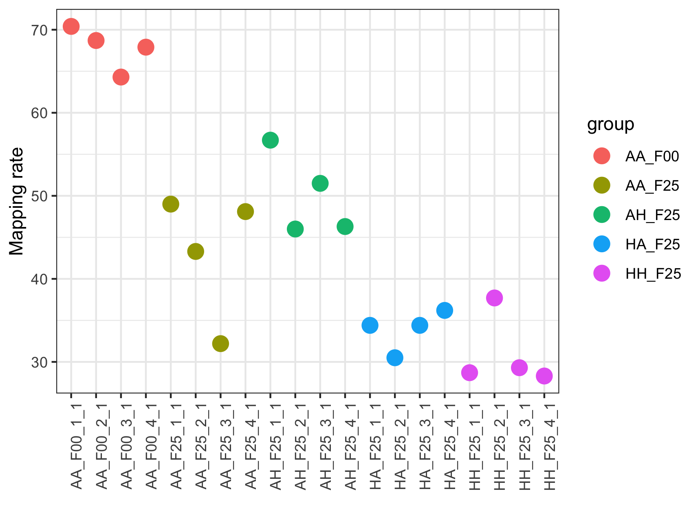
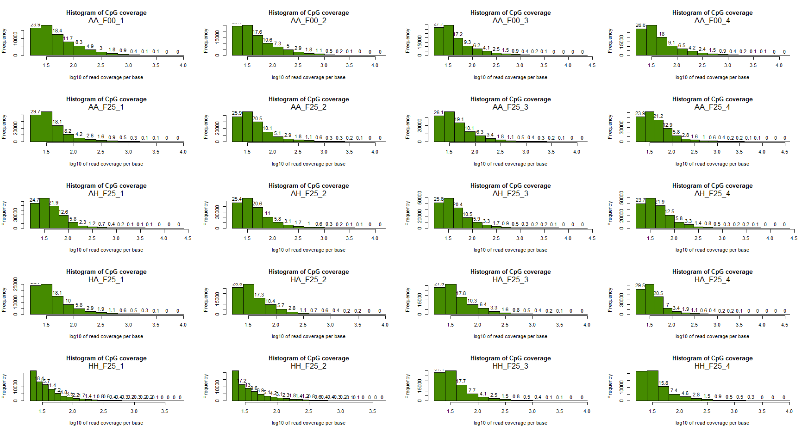

```{r setup, include=FALSE}
knitr::opts_chunk$set(echo = TRUE)
```
# The experiment  {.tabset .tabset-fade .tabset-pills}   

## Learning objectives:  
1. Background on the copepod selection experimental design  
2. Think about the hypotheses we can address with this experiment  
3. Cover how bisulfite sequencing data differs from regular data and not to panic when you see your fastqc output  
4. Begin mapping using Bismark  

## Copepod selection experiment  

Acartia tonsa is a calanoid copepod that has a world wide distribution. It inhabits estuaries and coastal waters and it typically the most abundant zooplankton present. Because of their huge population sizes and global distribution, they play an important role in ocean biogeochemical cycling and ecosystem functioning. For example, they’re an important food base for many fishes. Given their broad distribution in dynamic habitats (estuaries), they can tolerate and live in a broad range of salinities, freshwater to seawater, and temperatures, among other stressors.  

We know that the world is rapidly changing due to human activities and it is important to understand how species will respond to these changes. We were interested in understanding how A. tonsa could respond to stressful environments that will likely be caused by climate change. Can they adapt to rapid changes in temperature and acidity? How might epigenetic responses interact with adaptation to enable resilience?  

A. tonsa is a great system to ask these questions for a number of reasons. First, their generation time is only ~10-20 days and they’re tiny! Only 1-2 mm. This means we can easily execute multi-generational studies with thousands of individuals. Second, because they can tolerate such variable environments, they should have lots of plasticity to respond to environmental fluctuations. Finally, their large population sizes mean that genetic diversity should be high, giving them high adaptive potential. This means that if any species can respond to rapid environmental change, it is likely A. tonsa.   

## Experimental design  

A. tonsa were collected from the wild, common gardened for three generations, and then split into **four treatments** with **four replicates** each and about 3,000-5,000 individuals per replicate. They were left to evolve in these conditions for **25 generations**. Samples were collected at generation F0 and F25 to quantify methylation frequencies using **reduced representation bisulfite sequencing** [(RRBS)](https://en.wikipedia.org/wiki/Reduced_representation_bisulfite_sequencing).  

```{r , echo=FALSE, fig.cap="The experimental design", out.width = '80%'}

``` 

  
Sample ID	|Treatment    	  | Trt abrreviation	    | Generation  
--------- | --------------- | --------------------- | -------  
AA_F00_1	|Control: ambient temp, ambient CO2 |	AA	| F00  
AA_F25_2  |Control: ambient temp, ambient CO2	| AA	| F25  
AH_F25_3  |ambient temp, high CO2	            | AH  | F25  
HA_F25_1  |high temp, ambient CO2	            | HA	| F25
HH_F25_1  |high temp, high CO2	              | HH	| F25  


## RRBS  

- Stands for reduced representation bisulfite sequencing  
- Following the adapter ligation, we bisulfite convert all unmethylated C’s to T’s.  

- Before starting we also spiked in a small amount of DNA from E. coli that we know wasn’t methylated. Using this, we can calculate downstream how efficient our bisulfite conversion was.  

```{r  echo=FALSE, fig.cap="How RRBS works", out.width = '80%'}

``` 

## methylKit capabilities  
```{r  echo=FALSE, fig.cap="Flowchart for capabilities of methylKit package", out.width = '90%'}

``` 


# Pipeline {.tabset .tabset-fade .tabset-pills}  

1. Visualize, clean, visualize  

  - Visualize quality of raw data with fastqc  
  - clean raw data with Trimmomatic  
  - Visualize quality of cleaned data with fastqc  
2. Align to Acartia tonsa reference genome (**Bismark**)  
  - also align lambda DNA to check for conversion efficiency (Already Done)  
3. Extract methylation calls   
4. Process and filter calls  
5. Summary figures (PCA, clustering, etc)  
6. Test for differential methylation (Methylkit)  

## Bisulfite sequence data looks weird  
Unlike the normal sequence reads, in bisulfite conversion there is a high no. of T bases. This increase is because of the fact that all the non-methylated cytosines are converted to thyamine bases. While the that the reverse strand is the reverse complement of the bisulfite converted forward strand, and is not just the BS converted bottom strand. Thus reverse read being complement to the forward read will have a higher no. of adenine bases. 


```{r  echo=FALSE, fig.cap="Why bisulfite fastq visualization looks weird", out.width = '80%'}

``` 

## FastQ report  

```{r  echo=FALSE, fig.cap="FastQ for the bisulfite convereted forward read after trimming", out.width = '80%'}

```


```{r  echo=FALSE, fig.cap="FastQ for the bisulfite convereted reverse read after trimming", out.width = '80%'}

``` 


# Bismark  {.tabset .tabset-fade .tabset-pills}   
- Align to Acartia tonsa reference genome using Bismark  
- Align lambda DNA of E. coli ro check for the bisulfite conversion rate (~98%)  
**Location of data stored:**  
 cd /data/project_data/epigenetics/reference_genome/Bisulfite_Genome/  
 
**Sample assigned**  
 - AH_F25_4  
 
[**What is Bismark**](https://www.bioinformatics.babraham.ac.uk/projects/bismark/Bismark_User_Guide.pdf)  

- Bismark is a set of tools for the time-efficient analysis of Bisulfite-Seq (BS-Seq) data.  
- Bismark performs alignments of bisulfite-treated reads to a reference genome and cytosine methylation calls at the same time.   
- Bismark is written in Perl and is run from the command line.   
- Bisulfite-treated reads are mapped using the short read aligner `Bowtie 1` (Langmead B, Trapnell C, Pop M, Salzberg SL. Ultrafast and memory-efficient alignment of short DNA sequences to the human genome. Genome Biol 10:R25), or alternatively `Bowtie 2`, and therefore it is a requirement that Bowtie 1 (or Bowtie 2) are also installed on your machine (see Dependencies).  


All files associated with Bismark as well as a test BS-Seq data set can be downloaded from: 
http://www.bioinformatics.babraham.ac.uk/projects/bismark/  
 
## General form  

**USAGE:** `bismark [options] <genome_folder> {-1 <mates1> -2 <mates2> | <singles>}`  


**ARGUMENTS:**  
  
- `<genome_folder>` 
  - The path to the folder containing the unmodified reference genome as well as the subfolders created by the Bismark_Genome_Preparation script (/Bisulfite_Genome/CT_conversion/ and /Bisulfite_Genome/GA_conversion/).  
  - Bismark expects one or more fastA files in this folder(file extension: .fa, .fa.gz or .fasta or .fasta.gz). The path can be relative or absolute.  
  - The path may also be set as `--genome_folder /path/to/genome/folder/`.  

- `-1 <mates1>`              
  - Comma-separated list of files containing the #1 mates (filename usually includes"_1"), e.g. flyA_1.fq,flyB_1.fq). Sequences specified with this option must correspond file-for-file and read-for-read with those specified in <mates2>.  
  - Reads may be a mix of different lengths. Bismark will produce one mapping result and one report file per paired-end input file pair.  
  

- `-2 <mates2>`
  - Comma-separated list of files containing the #2 mates (filename usually includes "_2"), e.g. flyA_2.fq,flyB_2.fq). Sequences specified with this option must correspond file-for-file and read-for-read with those specified in <mates1>.  
  - Reads may be a mix of different lengths.  

- `<singles>`                
  - A comma- or space-separated list of files containing the reads to be aligned (e.g. lane1.fq,lane2.fq lane3.fq). Reads may be a mix of different lengths. 
  
- Bismark will produce one mapping result and one report file per input file.   
- Please note that one should supply a list of files in conjunction with --basename as the output files will constantly overwrite each other...

 
## Bash code

  - type bismark in bash to start the program 
 
  - `bismark -help` for help with the wrapper  
 
  - `--output_dir` - one output directory for all the data
 
  - forward read are - _1  
  - reverese reads are - _2  
  - adding read group  
    - `--rg_tag`
    - `--rg_id` - sample id  
  - `--gzip`  - compress  
  - `--local` - local alignment / soft clipping of the bases    
  - `--maxins` - max insert size 
```{bash eval=FALSE}
#!/bin/bash

bismark --bowtie2 --multicore 1 \
    --genome /data/project_data/epigenetics/reference_genome \
    --output_dir /data/project_data/epigenetics/aligned_output \
    -1 /data/project_data/epigenetics/trimmed_fastq/AH_F25_4_1.fq.gz \
    -2 /data/project_data/epigenetics/trimmed_fastq/AH_F25_4_2.fq.gz \
    --rg_tag --rg_id AH_F25_4 --rg_sample AH_F25_4 --gzip --local --maxins 1000
```
Bismark is, at its core, running [`bowtie2`](http://bowtie-bio.sourceforge.net/bowtie2/index.shtml). But there are important differences. If you remember, we’re using two modified versions of the genome where we’ve converted C-to-T AND G-to-A. We also generate temporary files of our trimmed reads where we convert C-to-T (read1) AND G-to-A (read2) so they can map to this converted genome. This makes the alignment a bit harder because : 
  1. the complexity of DNA is reduced  
  2. we are mapping to two separate genomes.   
  

**Parameters**  


`--bowtie2` tells bismark to map with bowtie2. There are other options possible here (bowtie1, for example)  

`--multicore 1` Use one core. We could use multiple cores to make alignment faster, but we may crash the server if many of you are mapping at once if we do this.  

`--genome` the location of our converted genome. The bismark package has a command to prep your genome that I've already done. You can check it out: `bismark_methylation_extractor --help`  
`-1` the path to your sample's forward read  
`-2` the path to your sample's reverse read  

`--rg_tag` add a read group tag that identifies your individual sample in your output bam file  

`--rg_id` the string that defines the readgroup ID  

`--rg_sample` the string that defines your readgroup sample ID  
`--gzip` for the temporary files, use gzip to save space  
`--local` align with the local alignment option in bowtie2. This will include soft clipping, which should increase mapping rate, but comes at the cost of (maybe) increasing mis-mapping.  

`--maxins` specifies the maximum insert size for mapping. We're using 1000 as our libraries had a mean insert size of ~200. Note that this is smaller than most sequencing libraries.  

```{bash eval=FALSE}
#!/bin/bash

bismark --bowtie2 --multicore 1 \
    --genome /data/project_data/epigenetics/reference_genome \
    --output_dir /data/project_data/epigenetics/aligned_output \
    -1 /data/project_data/epigenetics/trimmed_fastq/SAMPLEID_1.fq.gz \
    -2 /data/project_data/epigenetics/trimmed_fastq/SAMPLEID_2.fq.gz \
    --rg_tag --rg_id SAMPLEID --rg_sample SAMPLEID --gzip --local --maxins 1000
```

Here the SAMPLEID was replaced with my sample id `AH_F25_4`  


## Mapping reads  
- zcat to read the .gz files  

On Mac, use the following:
zcat < AA_F00_1_1_bismark_bt2_pe.bismark.cov.gz  


**Mapping rate**  
  - The mapping rate is very high in AA_F00, the control at zero generations, which can be worrying. This might be due to the fact that slightly more samples went into sequecing AA_F00.  
  - So including more DNAs might actually help increase the mapping rate.  
  - Maybe mapping them as single ends rather than paired end might help increase the mapping rate.  
  - THe bisulfite conversion rate was checked and found out to be 98-99%, when compared with the *E.coli* that was spiked in.
  
```{r  echo=FALSE, fig.cap="Mapping rates for different treatements", out.width = '80%'}

``` 

# Extract methylation calls  {.tabset .tabset-fade .tabset-pills}  

`bismark_methylation_extractor`  

**USAGE:** `bismark_methylation_extractor [options] <filenames>`  

A typical command to extract context-dependent (**CpG/CHG/CHH**) methylation could look like this:  
bismark_methylation_extractor -s --comprehensive  
test_dataset.fastq_bismark.sam  
This will produce three output files:  
(a) CpG_context_test_dataset.fastq_bismark.txt  
(b) CHG_context_test_dataset.fastq_bismark.txt  
(c) CHH_context_test_dataset.fastq_bismark.txt  


## Methylation report  

```{bash eval=FALSE}
bismark_methylation_extractor --bedGraph --scaffolds --gzip \
    --cytosine_report --comprehensive \
    --no_header \
    --parallel 6 \
    --output ~/tonsa_epigenetics/analysis/methylation_extract/ \
    --genome_folder /data/copepods/tonsa_genome/ \
    *pe.bam

```

[Methylation extraction report](https://htmlpreview.github.io/?https://github.com/PespeniLab/Ecological-Genomics/blob/master/Epigenetics_AA_F00_2_1_bismark_bt2_PE_report-ALL_SITES.html)  

**M-Bias Plot**  
  - Methylation Bias Plot  
  - CpG methylation is the dark line across the length of the read, and we are intersted in this line  
  - CpG methylation is same across the read, which is what we expect to see  
  - CpG reads are very high at the begining for *read 1*, we are unsure of what it is so we are going to **cut the first two bases** to remove this bias.  
    - It is generally recommended to remove this bias  
    - The same spike was also seen in the spiked E.coli  
    - The mechanism that is causing it is very unclear  
    - Generally considered as a technical artifact rather than a biological artifact  
  - *Read 2* shows a bit of a dip in CpG at the beginning  
  

## Methylation report ignoring bias  
**To ignore the first two bases:**  
- Done to remove the high CpG read at the begining of the reads   
```{bash eval=FALSE}
bismark_methylation_extractor --bedGraph --scaffolds --gzip \
    --cytosine_report --comprehensive \
    --no_header \
    --parallel 6 \
    --ignore 2 --ignore_r2 2 \
    # this says to ignore the first two bases
    --output ~/tonsa_epigenetics/analysis/methylation_extract/ \
    --genome_folder /data/copepods/tonsa_genome/ \
    *pe.bam
```

[Methylation extraction report ignoring bias](https://htmlpreview.github.io/?https://github.com/PespeniLab/Ecological-Genomics/blob/master/Epigenetics_AA_F00_2_1_bismark_bt2_PE_report-IGNORE_BIAS.html)  

## bash  

We can look at sites with some data using the following:  
```{bash eval=FALSE}
zcat HH_F25_4_1_bismark_bt2_pe.bismark.cov.gz | head
```

Column 1: Chromosome  
Column 2: Start position  
Column 3: End position  
  - Both start and stop column of the base we are intersted in are going to be same, since we are looking at single bases  
Column 4: Methylation percentage  
Column 5: Number of methylated C's  
Column 6: Number of unmethylated C's  

```{bash eval=FALSE}
zcat HH_F25_4_1_bismark_bt2_pe.bismark.cov.gz | awk '$4 > 5 && $5 > 10' | head
```
- says column 4 values > 5  

- says column 5 > ten methylated reads  


# methylKit  {.tabset .tabset-fade .tabset-pills}  

## R code  
Packages required:
```{r message=FALSE, warning=FALSE}
require(tidyverse)
require(pheatmap)

# fixing issues with methylKit package installation
# BiocManager::install("methylKit")
# install.packages("tibble", dependencies = TRUE, INSTALL_opts = '--no-lock')
require(methylKit)
require(plotly)
require(patchwork)

```

```{r}
# first, we want to read in the raw methylation calls with methylkit

# set directory with absolute path (why is this necessary? I have no idea, but gz files wont work with relative paths)
dir <- "C:\\Epigenetics_data\\Epigenetics_data\\"

list.files(dir)  
# read in the sample ids
samples <- read.table("C:\\Epigenetics_data\\Epigenetics_data\\sample_id.txt",
                      header = FALSE)
# now point to coverage files
files <- file.path(dir, samples$V1) # pasting the directory and samples together  
all(file.exists(files)) # to check if the path is real and points to the correct location 
# convert to list
file.list <- as.list(files) # for methylKit to run properly  
# get the names only for naming our samples
nmlist <- as.list(gsub("_1_bismark_bt2_pe.bismark.cov.gz","",samples$V1))
head(nmlist)
```


```{r message=FALSE, warning=FALSE}
# use methRead to read in the coverage files
## converting to a methylKit object from the list made  
myobj <- methRead(location = file.list,   # path to the files stored
                  sample.id = nmlist,     # sample ID info 
                  assembly = "atonsa",    # this is just a string. no actual database
                  dbtype = "tabix",       # going to make a database in the form of .txt files
                                          # this is also good for saving up on the memory
                  context = "CpG",      
                  resolution = "base",    # resolution is for SNPs so at a base elevel
                  mincov = 20,            # min 20 reads per site to get accurate estimation
                                          # 10 is an acceptable value too
                  treatment = c(0,0,0,0,  # four AA_F00 files
                                1,1,1,1,  # four AA_F25 files
                                2,2,2,2,  # four AH_F25 files
                                3,3,3,3,  # four HA_F25 files
                                4,4,4,4), # four HH_F25 files
                  pipeline = "bismarkCoverage", # input data format
                  dbdir = "C:\\Epigenetics_data\\") # not necessary to be specified
```


```{r}
######
# visualize coverage and filter
######

# We can look at the coverage for individual samples with getCoverageStats()
getCoverageStats(myobj[[1]], plot = TRUE, both.strands = FALSE) #Get CpG coverage information
# numbers on bars denote what percentage of locations are contained in that bin
# Experiments that are highly suffering from PCR duplication bias will have 
# a secondary peak towards the right hand side of the histogram

myobj[[1]] # no. of Cs and Ts should equal coverage

# looking at percent methylation 
getMethylationStats(myobj[[1]],plot=TRUE,both.strands=FALSE)

# and can plot all of our samples at once to compare.
# par(mfrow=c(5,4))
# 
# for(i in 1:length(myobj)) {
#   getCoverageStats(myobj[[i]], plot = TRUE, both.strands = FALSE) #Get CpG coverage information
# } #Plot and save %CpG methylation information
# 
# par(mfrow=c(1,1))
```

```{r  echo=FALSE, fig.cap="The histogram of CpG coverage for all the samples", out.width = '100%'}

``` 

```{r message=FALSE, warning=FALSE}
# filter samples by depth with filterByCoverage()
filtered.myobj <- filterByCoverage(myobj,
                                   lo.count = 20, lo.perc = NULL,
                                   hi.count = NULL, hi.perc = 97.5,
                                   db.dir = "C:\\Epigenetics_data\\")
```


```{r}
######
# merge samples
######

#Note! This takes a while and we're skipping it

# use unite() to merge all the samples. We will require sites to be present in each sample or else will drop it

# don't run as it takes a lot of time  
# meth <- unite(filtered.myobj, 
#                mc,cores=3, 
#                suffix="united", # add united at the end of the name
#                db.dir="C:\\Epigenetics_data\\")
```

Methylkit has a convenient aspect where we can load previously generated databases. This means we don’t have to re-run analyses, but can skip ahead to where we previously left off. We will do this below to load the united database that I’ve already generated.  
```{r}
meth <- methylKit:::readMethylBaseDB(
                      dbpath = "C:\\Epigenetics_data\\Epigenetics_data\\methylBase_united.txt.bgz",
                            dbtype = "tabix",
                            sample.id =   unlist(nmlist),
                            assembly = "atonsa", # this is just a string. not an actual database
                            context = "CpG",
                            resolution = "base",
                            treatment = c(0,0,0,0,
                              1,1,1,1,
                              2,2,2,2,
                              3,3,3,3,
                              4,4,4,4),
                            destrand = FALSE)
```

## Methylation statistics across samples
```{r}
# percMethylation() calculates the percent methylation for each site and sample
pm <- percMethylation(meth)
head(pm) # methylation percentage for each site per each sample
```


```{r}
#plot methylation histograms
ggplot(gather(as.data.frame(pm)), 
              aes(value)) + 
              geom_histogram(bins = 10, color="black", fill="grey") + 
              facet_wrap(~key)
```
- none of these are fully methylated  
- biological reason - pools of individuals, so if any slight change in one individual can affect the overall methylation levels for any individual site  
- differenes can also be present because of differenes due to different cell types  
- this U pattern is quite common in model organisms, with high methyaltion at zero and 100, and very low in between  
- The reason could also be technical  

```{r}
# calculate and plot mean methylation
sp.means <- colMeans(pm)

sp.means

dim(pm) # methlation for 15158 sites in 20 samples

p.df <- data.frame(sample=names(sp.means),
          group = substr(names(sp.means), 1,6),
          methylation = sp.means)

ggplot(p.df, aes(x=group, y=methylation, color=group)) + 
    stat_summary(color="black") + geom_jitter(width=0.1, size=3) +
  ylab("Percent Methylation") + xlab("Treatment") + theme_bw() + 
  theme(axis.text=element_text(size=14),
        axis.title=element_text(size=15,face="bold"))
## is the high methylation rate high in AA_F00 or is it due to it having higher mapping rate compared to the rest of the samples?? - hard to know  
```
- mean and std error are represented in the plot  
- methylation rate is higher in AA_F00 group  
  - is this due to higher mapping rate that was observed for AA_F00 before  
  - hard to know if a better library can lead to higher methylation rate score or tighter distribution with just this set of samples  
- mean methylation for each sample means the average methylaton rate across the whole genome or the 15000 sites studied here  
  - average of every site per sample  
  - we don't want a large varation across the means  
- in response to an environmental conditions the global methylation rate can increase or decrease; is there a genome wide response to being in the lab for 25 generations  


## Summarize variation: PCA, clustering  
**PCA**  
```{r}
# sample clustering
# looking for similarities and differences between the samples / treatments  
clusterSamples(meth,
               dist = "correlation", 
               method = "ward.D",    
               plot = TRUE)
# they are not clustering by treatments  
# F00 samples are clustering together  but not so much in other treatments 

# PCA
PCASamples(meth)
# similarly messy  
```

**find differentially methylated sites between two groups**  
```{r}
# subset with reorganize()

meth_sub <- reorganize(meth,
                sample.ids =c("AA_F00_1","AA_F00_2","AA_F00_3", "AA_F00_4",
                              "HH_F25_1","HH_F25_2","HH_F25_3","HH_F25_4"),
                treatment = c(0,0,0,0,1,1,1,1), # subsetting to just 8 samples
                save.db=FALSE) 

# calculate differential methylation

myDiff <- calculateDiffMeth(meth_sub,
                            overdispersion = "MN",
                            mc.cores = 1,
                            suffix = "AA_HH",
                            adjust = "qvalue", # FDR correction - commonly applied to genomic analysis  
                            test = "Chisq") # chi square 
# this model of overdispersion and test statistic seems to be the best


```
- fit a logistic regression to methylation values where explanatory variable is the treatment (case or control).  
  - and we compare the fit of the model with explanatory variable vs the null model (no explanatory variable) and ask if the fit is better using a Chisq test.  

- the methylation proportions are weighted by their coverage, as in a typical logistic regression. Note that in theory you could enter these as two column success and failure data frame, which is common in logistic regressions.  

- use overdispersion: Chisq without overdispersion finds more true positives, but many more false positives. good compromise is `overdispersion with Chisq`.   
  - reduced true pos, but really reduces false pos rate.  

```{r}
# get all differentially methylated bases
myDiff <- getMethylDiff(myDiff,
                        qvalue = 0.05, # taking out only the significant ones
                        difference = 10) # methylation differences that is taken to count as significant 
# 10 is an arbitary number- it can range from 10 to 25%

# we can visualize the changes in methylation frequencies quickly.

head(getData(myDiff)$meth.diff)
hist(getData(myDiff)$meth.diff) # methylation differences 
# hist before zero towards the left are hypomethylated and those towards the right are hypermethylated
# we see a lower methylation % in HH samples compared to AA saples

# get hyper methylated bases
hyper=getMethylDiff(myDiff,difference=10,qvalue=0.05,type="hyper")
hist(getData(hyper)$meth.diff)

# get hypo methylated bases
hypo=getMethylDiff(myDiff,difference=10,qvalue=0.05,type="hypo")
hist(getData(hypo)$meth.diff)
```

## Plots of differentially methylated groups
```{r}
#heatmaps first
pm <- percMethylation(meth_sub)

# make a dataframe with snp id's, methylation, etc.
sig.in <- as.numeric(row.names(myDiff))
pm.sig <- pm[sig.in,]

# add snp, chr, start, stop
din <- getData(myDiff)[,1:3]
df.out <- cbind(paste(getData(myDiff)$chr, 
                      getData(myDiff)$start, sep=":"), 
                din, pm.sig)
colnames(df.out) <- c("snp", 
                      colnames(din), 
                      colnames(df.out[5:ncol(df.out)]))
df.out <- (cbind(df.out,getData(myDiff)[,5:7]))

####
# heatmap
####

my_heatmap <- pheatmap(pm.sig,
        show_rownames = FALSE) # red is higher methylation


# we can also normalize 
ctrmean <- rowMeans(pm.sig[,1:4])

h.norm <- (pm.sig-ctrmean)

my_heatmap <- pheatmap(h.norm,
        show_rownames = FALSE)
##### if you want to change colors. only because I don't love the default colors.

paletteLength <- 50
myColor <- colorRampPalette(c("cyan1", "black", "yellow1"))(paletteLength)
myBreaks <- c(seq(min(h.norm), 0, length.out=ceiling(paletteLength/2) + 1), 
              seq(max(h.norm)/paletteLength, max(h.norm), length.out=floor(paletteLength/2)))
              
my_heatmap <- pheatmap(h.norm,
        color=myColor, 
        breaks=myBreaks,
        show_rownames = FALSE)


#####
#let's look at methylation of specific snps
####

# convert data frame to long form
head(df.out,3)
df.plot <- df.out[,c(1,5:12)] %>% 
                pivot_longer(-snp, values_to = "methylation")

df.plot$group <- substr(df.plot$name,1,2)
head(df.plot)

# looking at snp LS041600.1:376

df.plot %>% filter(snp=="LS041600.1:376") %>% 
            ggplot(., aes(x=group, y=methylation, color=group, fill=group)) +
              stat_summary(fun.data = "mean_se", size = 2) +
              geom_jitter(width = 0.1, size=3, pch=21, color="black")

## write bed file for intersection with genome annotation
write.table(file = "C:\\Epigenetics_data\\Epigenetics_data\\bed_files\\diffmeth.bed",
          data.frame(chr= df.out$chr, start = df.out$start, end = df.out$end),
          row.names=FALSE, col.names=FALSE, quote=FALSE, sep="\t")

```
## Link to genes  

**code template**  
- first path --> the location of the package stored - bedtools  
- `closest` - function in bedtools calling for closest features between samples  
  - [more details here](https://bedtools.readthedocs.io/en/latest/content/tools/closest.html)  
- > hits.bed - assigning name to the output file  
```{bash eval=FALSE}
/data/popgen/bedtools2/bin/bedtools closest -a DIFF.bedFILELOCATION \
      -b /data/project_data/epigenetics/GCA_900241095.1_Aton1.0_genomic.fa_annotation_table.bed \
      -D b | \
      awk '!($10=="-")' > hits.bed
```

```{bash eval=FALSE}
#!/bin/bash

/data/popgen/bedtools2/bin/bedtools closest -a /users/a/p/ap1/EcologicalGenomics/myresults/bedfiles_copepod/diffmeth.bed\
      -b /data/project_data/epigenetics/GCA_900241095.1_Aton1.0_genomic.fa_annotation_table.bed \
      -D b | \
      awk '!($10=="-")' > hits.bed # save filename is hits.bed
```

```{bash eval=FALSE}
# the annotation file here has the format: ScaffoldName  FromPosition  ToPosition  Sense TranscriptName  TranscriptPath  GeneAccession GeneName  GeneAltNames  GenePfam  GeneGo  CellularComponent MolecularFunction BiologicalProcess

# note that the hits.bed file will paste the diffmeth.bed file before the annotation table. So the first 3 columns are fom diffmeth.bed, then next 8 from the annotation table.

# count up number of hits

cat hits.bed | wc -l

# count number of unique named genes
cat hits.bed | cut -f 8 | sort | uniq -c

```

# Experiment {.tabset .tabset-fade .tabset-pills}  

## AA_F25 and AH_F25   

**find differentially methylated sites between two groups**  
```{r}
# subset with reorganize()

meth_sub <- reorganize(meth,
                sample.ids =c("AA_F25_1","AA_F25_2","AA_F25_3", "AA_F25_4",
                              "AH_F25_1","AH_F25_2","AH_F25_3","AH_F25_4"),
                treatment = c(0,0,0,0,1,1,1,1), # subsetting to just 8 samples
                save.db=FALSE) 

# calculate differential methylation
myDiff <- calculateDiffMeth(meth_sub,
                            overdispersion = "MN",
                            mc.cores = 1,
                            suffix = "AA_AH",
                            adjust = "qvalue", 
                            test = "Chisq") 

# get all differentially methylated bases
myDiff <- getMethylDiff(myDiff,
                        qvalue = 0.05, 
                        difference = 10) 

head(getData(myDiff)$meth.diff)
hist(getData(myDiff)$meth.diff) # methylation differences 
# hist before zero towards the left are hypomethylated and those towards the right are hypermethylated
# we see a lower methylation % in AH_F25 samples compared to AA_F25 samples

# get hyper methylated bases
hyper=getMethylDiff(myDiff,difference=10,qvalue=0.05,type="hyper")
dim(hyper)

# get hypo methylated bases
hypo=getMethylDiff(myDiff,difference=10,qvalue=0.05,type="hypo")
dim(hypo)


par(mfrow=c(1,2))
hist(getData(hyper)$meth.diff)
hist(getData(hypo)$meth.diff)
par(mfrow=c(1,2))
```

**Plots of differentially methylated groups**
```{r}
#heatmaps first
pm <- percMethylation(meth_sub)

# make a dataframe with snp id's, methylation, etc.
sig.in <- as.numeric(row.names(myDiff))
pm.sig <- pm[sig.in,]

# add snp, chr, start, stop
din <- getData(myDiff)[,1:3]
df.out <- cbind(paste(getData(myDiff)$chr, 
                      getData(myDiff)$start, sep=":"), 
                din, pm.sig)
colnames(df.out) <- c("snp", 
                      colnames(din), 
                      colnames(df.out[5:ncol(df.out)]))
df.out <- (cbind(df.out,getData(myDiff)[,5:7]))

####
# heatmap
####

my_heatmap <- pheatmap(pm.sig,
        show_rownames = FALSE) # red is higher methylation


# we can also normalize 
ctrmean <- rowMeans(pm.sig[,1:4])

h.norm <- (pm.sig-ctrmean)

my_heatmap <- pheatmap(h.norm,
        show_rownames = FALSE)

AH_heat <- my_heatmap

##### Recoloring the heatmaps.
paletteLength <- 50
myColor <- colorRampPalette(c("cyan1", "black", "yellow1"))(paletteLength)
myBreaks <- c(seq(min(h.norm), 0, length.out=ceiling(paletteLength/2) + 1), 
              seq(max(h.norm)/paletteLength, max(h.norm), length.out=floor(paletteLength/2)))
              
my_heatmap <- pheatmap(h.norm,
        color=myColor, 
        breaks=myBreaks,
        show_rownames = FALSE)


#####
#let's look at methylation of specific snps
####

# convert data frame to long form
head(df.out,3)
df.plot <- df.out[,c(1,5:12)] %>% 
                pivot_longer(-snp, values_to = "methylation")

df.plot$group <- substr(df.plot$name,1,2)
head(df.plot)


# looking at snp LS051659.1:1214

AH_snp <- df.plot %>% filter(snp=="LS051659.1:1214") %>% 
            ggplot(., aes(x=group, y=methylation, color=group, fill=group)) +
              stat_summary(fun.data = "mean_se", size = 2) +
              geom_jitter(width = 0.1, size=3, pch=21, color="black")
ggplotly(AH_snp)

## write bed file for intersection with genome annotation
# write.table(file = "C:\\Epigenetics_data\\Epigenetics_data\\bed_files\\AA_AH_diffmeth.bed",
#           data.frame(chr= df.out$chr, start = df.out$start, end = df.out$end),
#           row.names=FALSE, col.names=FALSE, quote=FALSE, sep="\t")

```


```{r}
AH_snp1 <- df.plot %>% filter(snp=="LS274951.1:141") %>% 
            ggplot(., aes(x=group, y=methylation, color=group, fill=group)) +
              stat_summary(fun.data = "mean_se", size = 2) +
              geom_jitter(width = 0.1, size=3, pch=21, color="black")  +
            ylab("Percent Methylation") + xlab("") + theme_bw() + 
            theme(axis.text=element_text(size=14),
                  axis.title=element_text(size=15,face="bold"),legend.position = "none") +
            ggtitle("Endonuclease III-like protein 1 ") + ylim(0,95)


AH_snp2 <- df.plot %>% filter(snp=="LS068114.1:6322") %>% 
            ggplot(., aes(x=group, y=methylation, color=group, fill=group)) +
              stat_summary(fun.data = "mean_se", size = 2) +
              geom_jitter(width = 0.1, size=3, pch=21, color="black")  +
            ylab("") + xlab("") + theme_bw() + 
            theme(axis.text=element_text(size=14),
                  axis.title=element_text(size=15,face="bold"),legend.position = "none") +
            ggtitle("Deoxyuridine 5’-triphosphate nucleotidohydrolase") + ylim(0,95)


AH_snp3 <- df.plot %>% filter(snp=="LS328870.1:810") %>% 
            ggplot(., aes(x=group, y=methylation, color=group, fill=group)) +
              stat_summary(fun.data = "mean_se", size = 2) +
              geom_jitter(width = 0.1, size=3, pch=21, color="black")  +
            ylab("") + xlab("") + theme_bw() + 
            theme(axis.text=element_text(size=14),
                  axis.title=element_text(size=15,face="bold")) + 
            ggtitle("Retrovirus-related Pol polyprotein from transposon 17.6") + ylim(0,95)
```

 
**Link to genes**   
 
```{bash eval=FALSE}
/data/popgen/bedtools2/bin/bedtools closest -a /users/a/p/ap1/EcologicalGenomics/myresults/bedfiles_copepod/AA_AH_diffmeth.bed\
      -b /data/project_data/epigenetics/GCA_900241095.1_Aton1.0_genomic.fa_annotation_table.bed \
      -D b | \
      awk '!($10=="-")' > AA_AH_hits.bed # save filename is hits.bed
```


```{bash eval=FALSE}
# count up number of hits

cat AA_AH_hits.bed | wc -l #18

# count number of unique named genes
cat AA_AH_hits.bed | cut -f 8 | sort | uniq -c

```


## AA_F25 and HH_F25  

**find differentially methylated sites between two groups**  
```{r}
# subset with reorganize()

meth_sub <- reorganize(meth,
                sample.ids =c("AA_F25_1","AA_F25_2","AA_F25_3", "AA_F25_4",
                              "HH_F25_1","HH_F25_2","HH_F25_3","HH_F25_4"),
                treatment = c(0,0,0,0,1,1,1,1), # subsetting to just 8 samples
                save.db=FALSE) 

# calculate differential methylation
myDiff <- calculateDiffMeth(meth_sub,
                            overdispersion = "MN",
                            mc.cores = 1,
                            suffix = "AA_HH",
                            adjust = "qvalue", 
                            test = "Chisq") 

# get all differentially methylated bases
myDiff <- getMethylDiff(myDiff,
                        qvalue = 0.05, 
                        difference = 10) 

head(getData(myDiff)$meth.diff)
hist(getData(myDiff)$meth.diff) # methylation differences 
# hist before zero towards the left are hypomethylated and those towards the right are hypermethylated
# we see a sightly higher methylation % in HH_F25 samples compared to AA_F25 samples

# get hyper methylated bases
hyper=getMethylDiff(myDiff,difference=10,qvalue=0.05,type="hyper")
dim(hyper)
# get hypo methylated bases
hypo=getMethylDiff(myDiff,difference=10,qvalue=0.05,type="hypo")
dim(hypo)

par(mfrow=c(1,2))
hist(getData(hyper)$meth.diff)
hist(getData(hypo)$meth.diff)
par(mfrow=c(1,2))
```

**Plots of differentially methylated groups**
```{r}
#heatmaps first
pm <- percMethylation(meth_sub)

# make a dataframe with snp id's, methylation, etc.
sig.in <- as.numeric(row.names(myDiff))
pm.sig <- pm[sig.in,]

# add snp, chr, start, stop
din <- getData(myDiff)[,1:3]
df.out <- cbind(paste(getData(myDiff)$chr, 
                      getData(myDiff)$start, sep=":"), 
                din, pm.sig)
colnames(df.out) <- c("snp", 
                      colnames(din), 
                      colnames(df.out[5:ncol(df.out)]))
df.out <- (cbind(df.out,getData(myDiff)[,5:7]))

####
# heatmap
####

my_heatmap <- pheatmap(pm.sig,
        show_rownames = FALSE) # red is higher methylation


# we can also normalize 
ctrmean <- rowMeans(pm.sig[,1:4])

h.norm <- (pm.sig-ctrmean)

my_heatmap <- pheatmap(h.norm,
        show_rownames = FALSE)
HH_heat <- my_heatmap


##### Recoloring the heatmaps.
paletteLength <- 50
myColor <- colorRampPalette(c("cyan1", "black", "yellow1"))(paletteLength)
myBreaks <- c(seq(min(h.norm), 0, length.out=ceiling(paletteLength/2) + 1), 
              seq(max(h.norm)/paletteLength, max(h.norm), length.out=floor(paletteLength/2)))
              
my_heatmap <- pheatmap(h.norm,
        color=myColor, 
        breaks=myBreaks,
        show_rownames = FALSE)


#####
#let's look at methylation of specific snps
####

# convert data frame to long form
head(df.out,3)
df.plot <- df.out[,c(1,5:12)] %>% 
                pivot_longer(-snp, values_to = "methylation")

df.plot$group <- substr(df.plot$name,1,2)
head(df.plot)

# looking at snp LS042748.1:7742

HH_snp <- df.plot %>% filter(snp=="LS219431.1:243") %>% 
            ggplot(., aes(x=group, y=methylation, color=group, fill=group)) +
              stat_summary(fun.data = "mean_se", size = 2) +
              geom_jitter(width = 0.1, size=3, pch=21, color="black")
ggplotly(HH_snp)
```


```{r}
# write bed file for intersection with genome annotation
# write.table(file = "C:\\Epigenetics_data\\Epigenetics_data\\bed_files\\AA_HH_diffmeth.bed",
#           data.frame(chr= df.out$chr, start = df.out$start, end = df.out$end),
#           row.names=FALSE, col.names=FALSE, quote=FALSE, sep="\t")

```

```{r}
# summary table
df.plot_filter1 <- df.plot %>% filter(group=="AA") %>% 
                    group_by(snp) %>% 
                    summarize(avgMeth = mean(methylation, na.rm = TRUE))
df.plot_filter1$Group <- "AA"

df.plot_filter2 <- df.plot %>% filter(group=="HH") %>% 
                    group_by(snp) %>% 
                    summarize(avgMeth = mean(methylation, na.rm = TRUE))
df.plot_filter2$Group <- "HH"

df.plot_filtered <- merge(df.plot_filter1,df.plot_filter2, by="snp") 

df.plot_filtered <- df.plot_filtered %>% arrange(desc(avgMeth.x))
head(df.plot_filtered) # the highest average methylated snps
```

```{r}
HH_snp1 <- df.plot %>% filter(snp=="LS049748.1:4514") %>% 
            ggplot(., aes(x=group, y=methylation, color=group, fill=group)) +
              stat_summary(fun.data = "mean_se", size = 2) +
              geom_jitter(width = 0.1, size=3, pch=21, color="black")  +
            ylab("Percent Methylation") + xlab("") + theme_bw() + 
            theme(axis.text=element_text(size=14),
                  axis.title=element_text(size=15,face="bold"),legend.position = "none") +
            ggtitle("STE20-like serine/threonine-protein kinase") + ylim(0,95)


HH_snp2 <- df.plot %>% filter(snp=="LS051669.1:9015") %>% 
            ggplot(., aes(x=group, y=methylation, color=group, fill=group)) +
              stat_summary(fun.data = "mean_se", size = 2) +
              geom_jitter(width = 0.1, size=3, pch=21, color="black")  +
            ylab("") + xlab("Treatment") + theme_bw() + 
            theme(axis.text=element_text(size=14),
                  axis.title=element_text(size=15,face="bold"),legend.position = "none") +
            ggtitle("Probable RNA-directed DNA polymerase from transposon BS") + ylim(0,95)


HH_snp3 <- df.plot %>% filter(snp=="LS070286.1:6277") %>% 
            ggplot(., aes(x=group, y=methylation, color=group, fill=group)) +
              stat_summary(fun.data = "mean_se", size = 2) +
              geom_jitter(width = 0.1, size=3, pch=21, color="black")  +
            ylab("") + xlab("") + theme_bw() + 
            theme(axis.text=element_text(size=14),
                  axis.title=element_text(size=15,face="bold")) + 
            ggtitle("Indolethylamine N-methyltransferase") + ylim(0,95)
```

## Plots  

```{r}
AH_heat
```


```{r}
HH_heat
```

```{r}

(AH_snp1 + AH_snp2 + AH_snp3) / (HH_snp1 + HH_snp2 + HH_snp3) + plot_annotation(tag_levels = "A")
```


**Link to genes**   
 
```{bash eval=FALSE}
/data/popgen/bedtools2/bin/bedtools closest -a /users/a/p/ap1/EcologicalGenomics/myresults/bedfiles_copepod/AA_HH_diffmeth.bed\
      -b /data/project_data/epigenetics/GCA_900241095.1_Aton1.0_genomic.fa_annotation_table.bed \
      -D b | \
      awk '!($10=="-")' > AA_HH_hits.bed # save filename is hits.bed
```


```{bash eval=FALSE}
# count up number of hits

cat AA_HH_hits.bed | wc -l #34

# count number of unique named genes
cat AA_HH_hits.bed | cut -f 8 | sort | uniq -c


cat AA_HH_hits.bed | cut -f 10-12 | head
```

```{bash eval=FALSE}
# getting only the unique hits as a bed file
awk '!seen[$8]++' AA_HH_hits.bed > AA_HH_uniqueHits.bed # save filename is hits.bed
```
# Bedtools results  {.tabset .tabset-fade .tabset-pills}   

## AA_AH_hits  
```{r}
AA_AH_hits <- read.csv("C:\\Epigenetics_data\\Epigenetics_data\\bed_files/AA_AH_hits.bed", sep="\t", header = FALSE)

knitr::kable(AA_AH_hits[,c(1:2,10:13,16:18)], format="pandoc")

```

## AA_AH_uniqueHits
```{r}
AA_AH_unique_hits <- read.csv("C:\\Epigenetics_data\\Epigenetics_data\\bed_files/AA_AH_uniqueHits.bed", sep="\t", header = FALSE)

# only unique 
knitr::kable(AA_AH_unique_hits[unique(AA_AH_unique_hits$V10),c(1:2,10:13,16:18)],
             format="pandoc")
```

## AA_HH_hits  
```{r}
AA_HH_hits <- read.csv("C:\\Epigenetics_data\\Epigenetics_data\\bed_files/AA_HH_hits.bed", sep="\t", header = FALSE)

knitr::kable(AA_HH_hits[,c(1:2,10:13,16:18)], format="pandoc")
```

## AA_HH_uniqueHits
```{r}
AA_HH_unique_hits <- read.csv("C:\\Epigenetics_data\\Epigenetics_data\\bed_files/AA_HH_uniqueHits.bed",
                              sep="\t", header = FALSE)

# only unique 
knitr::kable(AA_HH_unique_hits[unique(AA_HH_unique_hits$V10),c(1:2,10:13,16:18)],
             format="pandoc")


```

# Extra notes  

**SCP commandline** 
```{bash eval=F}
scp path/on/the/system ap1@pbio381.edu:~/
```


```{bash eval=F}
vim AA_HH_hits.bed 

:set nowrap # to see all the columns
```

```{bash eval=FALSE}
awk '!seen[$8]++' hits.bed | cut -f11- > uniqueHitsNames.bed
```
that code will remove duplicate lines and only print columns with the name of the gene and the annotation info 

```
 try adding sep="\t"

    also. read.table has issues sometimes with spaces. read.csv can be better


```


