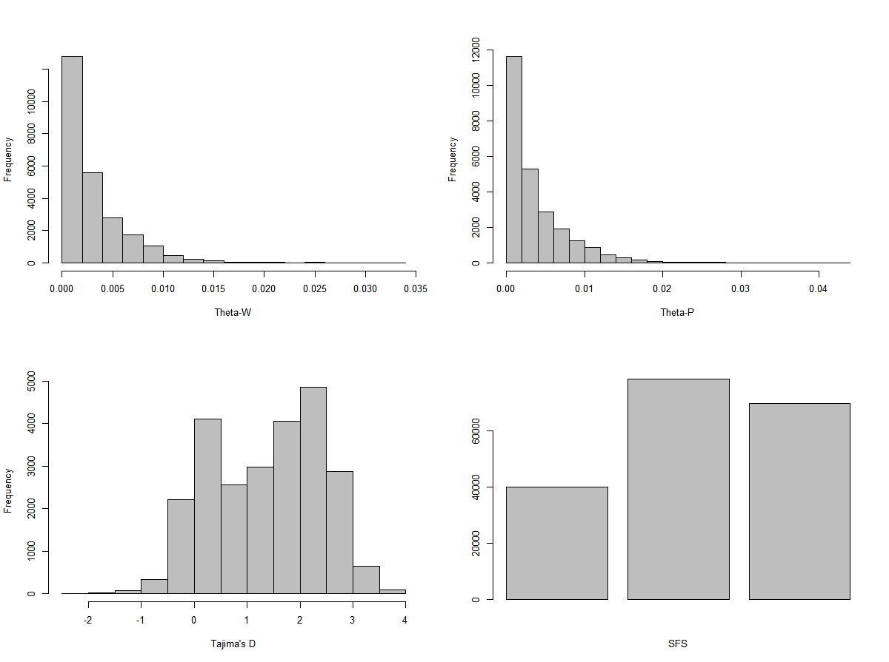

Common directory location where the data are stored:
`cd /data/project_data/RS_ExomeSeq/fastq/edge_fastq/`

# Visualize, Clean, Visualize  

## Program used : [fastqc](http://www.bioinformatics.babraham.ac.uk/projects/fastqc/), [Trimmomatic](http://www.usadellab.org/cms/index.php?page=trimmomatic) {.tabset .tabset-fade .tabset-pills}  

  - A fastq file is the standard sequence data format for NGS.  
  - It contains the sequence of the read itself, the corresponding quality scores for each base, and some meta-data about the read.  
  - The files are big (typically many Gb compressed), so we can’t open them completely. Instead, we can peek inside the file using head.  
  - But size these files are compressed (note the .gz ending in the filenames), and we want them to stay compressed while we peek.  
  `*_fastq.gz - compressed format and cannot use head or tail commands on it`  
  - Bash has a solution to that called `zcat`. This lets us look at the .gz file without uncompressing it all the way.  
  - `zcat` *filename.gz* `| head -n 4`  
    - which means, print the head of the compressed file upto the first four lines  
  
  **The fastq file format** has 4 lines for each read:  
  
  Line  | Description  
  ----- | -------------  
  1     | Always begins with ‘@’ and then information about the read  
  2     | The actual DNA sequence  
  3     | Always begins with a ‘+’ and sometimes the same info in line 1  
  4     | A string of characters which represent the quality scores; always has same number of characters as line 2  
  
  - [Quality - Phred - scores](http://www.drive5.com/usearch/manual/quality_score.html) are used to read the quality of the base call accuracy  
    - Phred Q scores are translated to ASCII characters so that the quality scores can be represented as a single character instead of double character, even though the scores stretches till 40.  
        
        ```
         Quality encoding: !"#$%&'()*+,-./0123456789:;<=>?@ABCDEFGHI
                           |         |         |         |         |
            Quality score: 0........10........20........30........40
        
        ```


The fastq files are in this path: `/data/project_data/RS_ExomeSeq/fastq/edge_fastq`  

So in a nutshell, fastqc are used for visaulizing the files, while trimmomatic are used to trimmomatic is used to trim the reads to a desired quality (based on Phred Q score), and then visualized again using fastqc. 


### basic bash loop structure  

Basic fastqc command:  
`fastqc FILENAME.fastq.gz -o outputdirectory/`  

Basic bash loop syntax  
```
for file in myfiles
do
  command 1 -options ${file}
  command 2 -options ${file}
done
```  
Here, `${file}` is a variable that is declared.  

To change the permission of the file created using fastqc, use the following bash command: `chmod u+x`

### fastqc  

Use `vim` to open editor and then press 'i' to enter insert mode for start typing the script got fastqc.  

Once the script is done, press *Esc* to exit the edit mode, then press ":" and type the following to save the file with a filename *fastqc.sh*. The *.sh* is added for the benefit of the user to understand what type of file it is. The *w* is to save/write and *q* is for quitting.  
`:wq fastqc.sh`  

```
#!/bin/bash

# moving the place the script will be run
cd ~/EcologicalGenomics/myresults/

# making a new directory to store results
mkdir fastqc

for file in /data/project_data/RS_ExomeSeq/fastq/edge_fastq/XGL*fastq.gz

do 

fastqc ${file} -o fastqc/

done
```  
### Trimmomatic  

The script is mostly in java. Variable coding is used to call the name of the R1 read pair, define the name for the second read in the pair (R2), and create a basename that only contains the “pop_ind” part of the name, i.e. XGL_05. 
Trimmomatic performs the **cleaning steps**.

 `R2=${R1/_R1_fastq.gz/_R2_fastq.gz}` # defines the name for the second read in the pair (R2) based on knowing the R1 name (the file names are identifcal except for the R1 vs. R2 designation)  
 `f=${R1/_R1_fastq.gz/}` # creates a new variable from R1 that has the "_R1_fastq.gz" stripped off  
 name=`basename ${f}`   # calls the handy "basename" function to define a new variable containing only the very last part of the filename while stripping off all the path information.  This gets us the "XGL_05" bit we want.  
    

** The code used to run trimmomatic**  
```
#!/bin/bash   
 
cd /data/project_data/RS_ExomeSeq/fastq/edge_fastq  

for R1 in AB*R1_fastq.gz  

do 
 
    R2=${R1/_R1_fastq.gz/_R2_fastq.gz}
    f=${R1/_R1_fastq.gz/}
    name=`basename ${f}`

    java -classpath /data/popgen/Trimmomatic-0.33/trimmomatic-0.33.jar org.usadellab.trimmomatic.TrimmomaticPE \
        -threads 1 \
        -phred33 \
         "$R1" \
         "$R2" \
         /data/project_data/RS_ExomeSeq/fastq/edge_fastq/pairedcleanreads/${name}_R1.cl.pd.fq \
         /data/project_data/RS_ExomeSeq/fastq/edge_fastq/unpairedcleanreads/${name}_R1.cl.un.fq \
         /data/project_data/RS_ExomeSeq/fastq/edge_fastq/pairedcleanreads/${name}_R2.cl.pd.fq \
         /data/project_data/RS_ExomeSeq/fastq/edge_fastq/unpairedcleanreads/${name}_R2.cl.un.fq \
        ILLUMINACLIP:/data/popgen/Trimmomatic-0.33/adapters/TruSeq3-PE.fa:2:30:10 \
        LEADING:20 \
        TRAILING:20 \
        SLIDINGWINDOW:6:20 \
        MINLEN:35 
 
done 


```
**Options of Trimmomatic used are as follows**  
ILLUMINACLIP: Cut adapter and other illumina-specific sequences from the read.  
LEADING: Cut bases off the start of a read, if below a threshold quality  
TRAILING: Cut bases off the end of a read, if below a threshold quality  
SLIDINGWINDOW: Perform a sliding window trimming, cutting once the average quality within the window falls below a threshold.  
MINLEN: Drop the read if it is below a specified length  


# Mapping and Indexing  

## Program used : [BWA](http://bio-bwa.sourceforge.net/bwa.shtml), samtools, sambamba {.tabset .tabset-fade .tabset-pills}  

BWA is a very efficient read mapper and works really well with this exome data.  
The basic bwa command that will be used is as follows:  

`bwa mem -t 1 -M -a ${ref} ${forward} ${reverse} > ${output}/BWA/${name}.sam`  

Where;  
```
    -t 1 is the number of threads, or computer cpus to use (in this case, just 1)
    -M labels a read with a special flag if its mapping is split across >1 contig
    -a keeps alignments involving unpaired reads
    ${ref} specifies the path and filename for the reference genome
    ${forward} specifies the path and filename for the cleaned and trimmed R1 reads 
    ${reverse} specifies the path and filename for the cleaned and trimmed R2 reads 
>${output}/BWA/${name}.sam  directs the .sam file to be saved into a directory called BWA
```

      

### mypipeline.sh 

The scripts for the pipeline is written in a text editor (notepad++ for windows). The process of writing scripts is broken down into multiple parts, i.e. for each part of the pipeline a new script is created. The **wrapper script** for the pipeline is the `mypipeline.sh` which will direct to run the supporting scripts files `mapping.sh`  `process_bam.sh` `bamstats.sh` as a single process.
```

#!/bin/bash

# Path to my repo:

myrepo="/users/s/r/zportlas/Ecological_Genomics/Spring_2020"

# echo ${myrepo}

# My population:

mypop="XGL"

# Directory to cleaned and paired reads:

input="/data/project_data/RS_ExomeSeq/fastq/edge_fastq/pairedcleanreads/${mypop}"

# Directory in common space where we'll store mapping output for everyone to use

output="/data/project_data/RS_ExomeSeq/mapping"  
```

### mapping.sh  

The reads are mapped to the reference genome using bwa. The reference genome of Norway spruce is huge (~20 Gb), so instead of using the whole genome for mapping only the exome / coding regions are used. For this purpose, the probes were designed just for the exome region and then BLAST ed to search for each probe. We have information on the contigs, which are small DNA sequences used to construct the map. However, there is not enough information to say for sure where these contigs lie on the chromosomes.  

This reduced reference contains:  
  - 668,091,227 bp (~668 Mbp) in 33,679 contigs  
  - The mean (median) contig size is 10.5 (12.9) kbp  
  - The N50 of the reduced reference is 101,375 bp  

The **reference genome** is located here: `cd /data/project_data/RS_ExomeSeq/ReferenceGenomes/`  

To get reference genome online and dowload for use, the following code can be used: `wget "http://plantgenie.org/Picea_abies/v1.0/FASTA/GenomeAssemblies/Pabies1.0-genome.fa.gz"`   


N50   
- take the contigs when it reaches the 50% of the total basepairs - the contig at this location and how big it is in terms of basepairs is the N50 value    
- looking for a big no. for the N50  
- So this number looks at how well assembled the DNA fragements are !  
- More of a benchmark, and there are other metrics as well, like N90. [more info needed]    

```
#!/bin/bash

# this script will run the read mapping using "bwa" program

ref="/data/project_data/RS_ExomeSeq/ReferenceGenomes/Pabies1.0-genome_reduced.fa"

# Write a loop to map each individual within my population

for forward in ${input}*_R1.cl.pd.fq

do
reverse=${forward/_R1.cl.pd.fq/_R2.cl.pd.fq}
f=${forward/_R1.cl.pd.fq/}
name=`basename ${f}`
bwa mem -t 1 -M ${ref} ${forward} ${reverse} > ${output}/BWA/${name}.sam
done 
```
### process_bam.sh  

  - Converts sam files to bam files and sorts them.  

  - Removal of PCR duplicate sequences

    - PCR duplicates occur when multiple reads align to the same start position in the genome  
    - PCR duplicates will lead to misidentifying a duplicate as a true variation.  
    - SAMTools identifies PCR duplicates and keeps the read with the highest mapping quality score  
    - Removing duplicates can improve accuracy of variant calls  
  - Then the duplicates are indexed  

```
#!/bin/bash

# This is where our output sam files are going to get converted into binary (bam)
# Then we're going to sort the bam files, remove the PCR duplicates, and index them

# First, let's convert sam to bam and then sort

for f in ${output}/BWA/${mypop}*.sam

do
out=${f/.sam/}
sambamba-0.7.1-linux-static view -S --format=bam ${f} -o ${out}.bam
samtools sort ${out}.bam -o ${out}.sorted.bam
done

# Now lets remove the PCR duplicates from our bam files:
for file in ${output}/BWA/${mypop}*.sorted.bam

do
f=${file/.sorted.bam/}
sambamba-0.7.1-linux-static markdup -r -t 1 ${file} ${f}.sorted.rmdup.bam
done

# Now to finish, we'll index our files

for file in ${output}/BWA/${mypop}*.sorted.rmdup.bam

do
samtools index ${file}
done
```

### bamstats.sh   

**samtools**  
  - powerful tool for manipulating sam/bam files  
  - `flagstat` command of samtools gives basic informatio on how well the mapping worked  
    - `samtools flagstat` *filename,sam*  
  - `tview` - to view the alignment files (sam or bam)  
    - `samtools tview` *path to the sam/bam file* *path to the reference genome*  
    - `samtools tview` /data/project_data/RS_ExomeSeq/mapping/BWA/XGL_05.sorted.rmdup.bam /data/project_data/RS_ExomeSeq/ReferenceGenomes/Pabies1.0-genome_reduced.fa  

To get stats on how well the mapping worked  
`samtools flagstat file.sorted.rmdup.bam | awk 'NR>=5&&NR<=13 {print $1}' | column -x`  
`samtools depth file.sorted.rmdup.bam | awk '{sum+=$3} END {print sum/NR}`  

Depth of coverage is also estimated on this step.  

**Note**  
in awk - `NR` stands for the no. of rows  


```
!#/bin/bash

# set repo
myrepo="/users/a/p/ap1/EcologicalGenomics"

mypop="XGL"

output="/data/project_data/RS_ExomeSeq/mapping/"

echo "Num.reads R1 R2 Paired MateMapped Singletons MateMappedDiffChr" >${myrepo}/myresults/${mypop}.flagstats.txt

for file in ${output}/BWA/${mypop}*sorted.rmdup.bam

	do
		f=${file/.sorted.rmdup.bam/}
		name=`basename ${f}`
		echo ${name} >> ${myrepo}/myresults/${mypop}.name.txt # the >> - appends the file at the end of the list rather than overwriting it
		samtools flagstat ${file} | awk 'NR>=6&&NR<=12 {print $1}' | column -x
	done  >> ${myrepo}/myresults/${mypop}.flagstats.txt # >> append the results of the for loop to a files
	
# Calculate depth of coverage from our bam files

for file in ${output}/BWA/${mypop}*sorted.rmdup.bam
	
	do
		samtools depth ${file} | awk '{sum+=$3} END {print sum/NR}' #sum up the third column and calculate the proportion
		done >> ${myrepo}/myresults/${mypop}.coverage.txt
```

### Summary  

A SAM file is a tab delimited text file that stores information about the alignment of reads in a FASTQ file to a reference genome or transcriptome. For each read in a FASTQ file, there’s a line in the SAM file that includes  

  - the read, aka. query, name  
  - a FLAG (number with information about mapping success and orientation and whether the read is the left or right read)  
  - the reference sequence name to which the read mapped  
  - the leftmost position in the reference where the read mapped  
  - the mapping quality (Phred-scaled)  
  - a CIGAR string that gives alignment information (how many bases Match (M), where there’s an Insertion (I) or Deletion (D))  
  - an ‘=’, mate position, inferred insert size (columns 7,8,9)  
  - the query sequence and Phred-scaled quality from the FASTQ file (columns 10 and 11)  
  - then Lots of good information in TAGS at the end, if the read mapped, including whether it is a unique read (XT:A:U), the number of best hits (X0:i:1), the number of suboptimal hits (X1:i:0).  
  
The left (R1) and right (R2) reads alternate through the file. SAM files usually have a header section with general information where each line starts with the ‘@’ symbol.  

  - SAM and BAM files contain the same information 
  - SAM is human readable but has a large size and BAM is in binary code and therefore has a smaller file size.  
  - Usually SAM files are not kept, however they can be easily generated from thr BAM files  
  - BAM file extension - *filename* **sorted.rmdup.bam**  
  - BAM index file extension - **.bai** - a companion file for bam files  
  - [SAM decoder](https://broadinstitute.github.io/picard/explain-flags.html) to decode the second column of numbers  
  
**samtools**  
  - powerful tool for manipulating sam/bam files  
  - `flagstat` command of samtools gives basic informatio on how well the mapping worked  
    - `samtools flagstat` *filename,sam*  
  - `tview` - to view the alignment files (sam or bam)  
    - `samtools tview` *path to the sam/bam file* *path to the reference genome*
    
  - `samtools index` *filename* - used to index the bam files after removing the PCR duplicates using sambamba  
  
**sambamba**  
- `sambamba markdup -r -t 1` - used to remove the PCR duplicates using the `markdup` function of sambamba program  

      
  


# Genotype likelihoods 


## Program used : [ANGSD](https://bmcbioinformatics.biomedcentral.com/articles/10.1186/s12859-014-0356-4)  {.tabset .tabset-fade .tabset-pills}   

**Analysis of Next Generation Sequence Data**  

There is some degree of uncertainity in the observed genotypes and they are not true genotypes. Read data are counts that produce a multinomial distribution of alleles at a given site. With only a few reads, you can't determine the geneotype confidently.  

A **genotype likelihood (GL)** is essentially the probability of observing the sequencing data (reads containing a particular base), given the genotype of the individual at that site. ANGSD allows us to incorporate uncertainty into our analysis.  

 

### Workflow  

  - Create a list of bam files for the samples you want to analyze  
  - Estimate genotype likelihoods (GL’s) and allele frequencies after filtering to minimize noise  
  - Use GL’s to:  
    - estimate the site frequency spectrum (SFS)  
    - estimate nucleotide diversities (Watterson’s theta, pi, Tajima’s D, …)  
    - estimate $F_{ST}$ between all populations, or pairwise between sets of populations  
    - perform a genetic PCA based on estimation of the genetic covariance matrix (this is done on the entire set of Edge ind’s)  


### ANGSD [folded] (ANGSD_mypop.sh)  
```
myrepo="/users/a/p/ap1/EcologicalGenomics"

#mkdir ${myrepo}/myresults/ANGSD

output="${myrepo}/myresults/ANGSD"

mypop="XGL"

ls /data/project_data/RS_ExomeSeq/mapping/BWA/${mypop}_*sorted.rm*.bam >${output}/${mypop}_bam.list #ls used to get only the list of the names

REF="/data/project_data/RS_ExomeSeq/ReferenceGenomes/Pabies1.0-genome_reduced.fa" # reference genome location

# Estimating GL's and allele frequencies for all sites with ANGSD 

# Now lets calculate the SFS for the folded minor allele spectra:
ANGSD -b ${output}/${mypop}_bam.list \
-ref ${REF} -anc ${REF} \
-out ${output}/${mypop}_folded_allsites \
-nThreads 1 \
-remove_bads 1 \
-C 50 \
-baq 1 \
-minMapQ 20 \
-minQ 20 \
-setMinDepth 3 \
-minInd 2 \
-setMinDepthInd 1 \
-setMaxDepthInd 17 \
-skipTriallelic 1 \
-GL 1 \
-doCounts 1 \
-doMajorMinor 1 \
-doMaf 1 \
-doSaf 1 \
-fold 1

```
### SFS prior  
```
# Get rough first estimate of the SFS, then use as a prior for the next estimate

realSFS ${output}/${mypop}_folded_allsites.saf.idx \
-maxIter 1000 -tole le-6 -P 1 \
> ${output}/${mypop}_outFold.sfs

```

### Refined estimate of SFS and theta diversity stats  
```
# Get refined estimate of the SFS and doTheta
ANGSD -b ${output}/${mypop}_bam.list \
-ref ${REF} -anc ${REF} \
-out ${output}/${mypop}_folded_allsites \
-nThreads 1 \
-remove_bads 1 \
-C 50 \
-baq 1 \
-minMapQ 20 \
-minQ 20 \
-setMinDepth 3 \
-minInd 2 \
-setMinDepthInd 1 \
-setMaxDepthInd 17 \
-skipTriallelic 1 \
-GL 1 \
-doCounts 1 \
-doMajorMinor 1 \
-doMaf 1 \
-doSaf 1 \
-fold 1 \
-pest ${output}/${mypop}_outFold.sfs \
-doThetas 1
```  
### Estimate nucleotide diversity  
```
# Use the doTheta output from above to estimate nucleotide diversity

thetaStat do_stat ${output}/${mypop}_folded_allsites.thetas.idx
```


### ANGSD [unfolded]
```
myrepo="/users/a/p/ap1/EcologicalGenomics"

#mkdir ${myrepo}/myresults/ANGSD

output="${myrepo}/myresults/ANGSD"

mypop="XGL"

ls /data/project_data/RS_ExomeSeq/mapping/BWA/${mypop}_*sorted.rm*.bam >${output}/${mypop}_bam.list #ls used to get only the list of the names

REF="/data/project_data/RS_ExomeSeq/ReferenceGenomes/Pabies1.0-genome_reduced.fa" # reference genome location

# Estimating GL's and allele frequencies for all sites with ANGSD

# Estimating GL's and allele frequencies for all sites with ANGSD

ANGSD -b ${output}/${mypop}_bam.list \
-ref ${REF} -anc ${REF} \
-out ${output}/${mypop}_allsites \
-nThreads 1 \
-remove_bads 1 \
-C 50 \
-baq 1 \
-minMapQ 20 \
-minQ 20 \
-setMinDepth 3 \
-minInd 2 \
-setMinDepthInd 1 \
-setMaxDepthInd 17 \
-skipTriallelic 1 \
-GL 1 \
-doCounts 1 \
-doMajorMinor 1 \
-doMaf 1 \
-doSaf 1 \
-doHWE 1 \
# -SNP_pval 1e-6

```
## Program used : R {.tabset .tabset-fade .tabset-pills} 

### R code  


```r
setwd("C:\\Dropbox\\UVM\\5. Courses\\4. Spring 2020\\Ecological Genomics\\EcologicalGenomics\\SFS_EcoGen")

# list.files()

SFS <- scan("XGL_outFold.sfs")

sumSFS <- sum(SFS)

pctPoly <- 100*(1-(SFS[1]/sumSFS))
pctPoly
```

```
## [1] 0.7799495
```

```r
plotSFS <- SFS[-c(1,length(SFS))]
plotSFS
```

```
## [1] 39885.50 78238.31 69611.83
```

```r
barplot(plotSFS)
```


```r
div <- read.table("XGL_folded_allsites.thetas.idx.pestPG")

colnames(div) <- c("window", "chrname","wincenter","tW","tP","tF","tH","tL",
                   "tajD","fulif","fuliD","fayH","zengsE","numSites")

div$tWpersite <- div$tW/div$numSites
div$tPpersite <- div$tP/div$numSites

par(mfrow=c(2,2))
hist(div$tWpersite, col="gray",xlab="Theta-W",main="")
hist(div$tPpersite, col="gray",xlab="Theta-P",main="")
hist(div$tajD, col="gray",xlab="Tajima's D",main="")
barplot(plotSFS)
```


```r
# dev.off() # closes the pdf and writes it to file

summary(div)
```

```
##                       window             chrname        wincenter    
##  (0,397)(4,401)(0,401)   :    2   chloroplast:    1   Min.   :   54  
##  (0,0)(192,192)(0,192)   :    1   MA_1       :    1   1st Qu.: 1247  
##  (0,0)(4621,4621)(0,4621):    1   MA_10001693:    1   Median : 3338  
##  (0,1)(1338,1339)(0,1339):    1   MA_10002   :    1   Mean   : 6581  
##  (0,1)(269,270)(0,270)   :    1   MA_10002614:    1   3rd Qu.: 8859  
##  (0,1)(2797,2798)(0,2798):    1   MA_10002669:    1   Max.   :98537  
##  (Other)                 :24786   (Other)    :24787                  
##        tW                 tP                 tF          tH          tL   
##  Min.   :  0.0000   Min.   :  0.0000   Min.   :0   Min.   :0   Min.   :0  
##  1st Qu.:  0.6286   1st Qu.:  0.6876   1st Qu.:0   1st Qu.:0   1st Qu.:0  
##  Median :  1.6893   Median :  1.9588   Median :0   Median :0   Median :0  
##  Mean   :  3.9633   Mean   :  4.8072   Mean   :0   Mean   :0   Mean   :0  
##  3rd Qu.:  4.3346   3rd Qu.:  5.2100   3rd Qu.:0   3rd Qu.:0   3rd Qu.:0  
##  Max.   :129.6079   Max.   :162.1646   Max.   :0   Max.   :0   Max.   :0  
##                                                                           
##       tajD             fulif             fuliD             fayH        
##  Min.   :-2.0510   Min.   :0.05004   Min.   :0.0485   Min.   :0.07033  
##  1st Qu.: 0.4244   1st Qu.:1.22945   1st Qu.:1.1623   1st Qu.:1.66341  
##  Median : 1.5165   Median :1.87208   Median :1.6733   Median :2.44543  
##  Mean   : 1.3764   Mean   :1.84748   Mean   :1.6387   Mean   :2.36708  
##  3rd Qu.: 2.2316   3rd Qu.:2.48321   3rd Qu.:2.1390   3rd Qu.:3.12110  
##  Max.   : 3.9632   Max.   :3.38890   Max.   :2.7418   Max.   :4.05147  
##                    NA's   :2         NA's   :2        NA's   :2        
##      zengsE            numSites        tWpersite           tPpersite        
##  Min.   :-3.61611   Min.   :     0   Min.   :0.0001010   Min.   :0.0000931  
##  1st Qu.:-2.81689   1st Qu.:   499   1st Qu.:0.0008799   1st Qu.:0.0009537  
##  Median :-2.20164   Median :   879   Median :0.0018945   Median :0.0022169  
##  Mean   :-2.15712   Mean   :  1315   Mean   :0.0030002   Mean   :0.0036440  
##  3rd Qu.:-1.52810   3rd Qu.:  1659   3rd Qu.:0.0041236   3rd Qu.:0.0050436  
##  Max.   :-0.06373   Max.   :106648   Max.   :0.0337746   Max.   :0.0430208  
##  NA's   :2                           NA's   :2           NA's   :2
```


### The plots  

<div class="figure">

<p class="caption">Clock wise from top left: Watterson's theta, pi, SFS and Tajima's D for XGL population of red spruce</p>
</div>


##  


