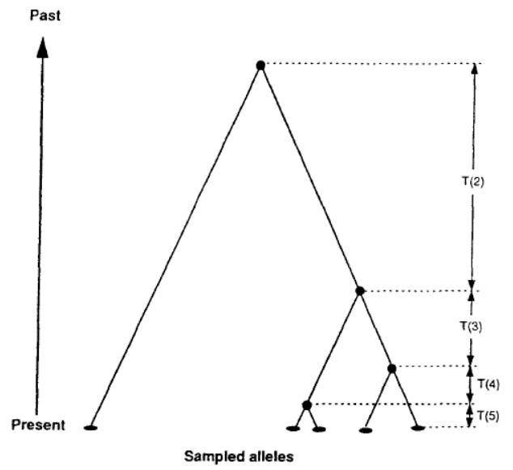

```{r setup, include=FALSE}
knitr::opts_chunk$set(echo = TRUE)
```

**Affiliation**:  Keller Lab; Department of Plant Biology, University of Vermont  
**E-mail contact**:  anoob.prakash@uvm.edu  
**Start Date**: 2020-01-13  
**End Date**: 2020-05-08  
**Project Descriptions**: Climate change adaptation in red spruce  

<!-- ## Table of Contents:   -->
<!-- [Working with the terminal ](#terminal)   -->
<!-- [bash commands](#basicBash)  -->
<!-- [Working with fastq](./fastq.html)    -->
<!-- [Trimmomatic]()   -->


<!-- [Course Materials](https://docs.google.com/document/d/1MuXPS3hNg3wIxsKw-jQmKY7y57Ka2qqZwHYKRAbpNMw/edit?usp=sharing)  -->

<!-- [UNIX cheatsheet](https://files.fosswire.com/2007/08/fwunixref.pdf) -->

-----
# Working with the terminal <a name="terminal"></a>  
**Log into UNIX server through RStudio terminal**  


Start a Rmarkdown file. Go to terminal on RStudio, type in the following to change the language to bash:  

`/usr/bin/env bash -l`  

Might want to use putty software to connect to server, if for some reason the terminal throws permission denied message when trying to connect to the server using the `ssh` command.  

 
Type in the details to login to the server:  
 
 `ssh` `username`@`servername`  
 
 For example, type in netID followed by the server ID:  
 
 `ssh netID@pbio381.uvm.edu`  

Next type in your net ID password, and now you can accesss the UNIX shell like you would be accesssing through the terminal on MAC or through PUTTY on Windows.  

If you want run the codes that you currently have Rmarkdown, use `Ctrl + Alt + Enter`  

Additonal tip for Windows users, there is an alterantive to putty on windows store. Just download and install ubuntu and it works as a linux shell. It seems more integrated and part of the windows system, however you cannot save login credentials like you can on putty.  
   
 
 More details on RStudio terminal can be  found here: https://support.rstudio.com/hc/en-us/articles/115010737148-Using-the-RStudio-Terminal   
 
**Location of shared data on the server:** `/data/project_data/RS_ExomeSeq`  
 
*** 
 
## bash commands <a name="basicBash"></a>  

Description                                     | Commands  
----------------------------------------------- | --------
Finding what directory you’re in:               |   `pwd`  
Listing files in your current directory:        |   `ll`  `ls`
Changing to a new directory:                    |   `cd`  
Making a new folder                             |`mkdir` *foldername*  
Copying or moving files from one location to another| `cp` *filename destinationpath/*,  `mv` *filename destinationpath/*  
Peeking into the first or last few lines of a file  | `head` *filename*, `tail` *filename*  
Searching within a file for a match              | `grep` **search string** *filename*  
Outputing the results of a command to a new file | `grep` **search string** *filename* >outputfilename  
Using the “pipe” to send the output of one command to the input of another | `grep` **text
Removing files or folders [use with caution as the action is irreversible]  | `rm`   
<p style="color:green"> Github specific</p>  
Description                                     | Commands  
----------------------------------------------- | --------  
Cloning a git repo                              | `git clone`  
Pull from the server                            | `git pull` 
Git add                                         | `git add --all`  
Commit changes                                  | `git commit -m` *comment about the commit*  
Push to the server                              | `git push`  


**Tweaking the rm command on the server**  
Once you remove a file with `rm` command on the UNIX server, its lost for good. In order to make sure that its not an accidental deletition, we can make the server ask the user to confirm before deletion. For that, the following steps need to be followed.  
1. Go to your home directory (`cd ~/`)  
2. List hidden files (`ll -a`)  
3. Open **.bashrc** - contains settings for when you want to interact with the server - with `vim .bashrc` or any other text editor you use on the server.  
4. Type in the following command under **# User specific aliases and functions** by going into the insert mode (by pressing *i* on the keyboard): `alias rm='rm -i'`  
5. Your file should look like the following  
```{}
# .bashrc

  # Source global definitions
  if [ -f /etc/bashrc ]; then
          . /etc/bashrc
  fi

  # Uncomment the following line if you don't like systemctl's auto-paging feature:
  # export SYSTEMD_PAGER=

  # User specific aliases and functions

  alias rm='rm -i'
```
6. Press **esc** on the keyboard to exit out of the edit mode.  
7. Type `:wq`  (`w` is to write the changes and `q` is to quit out of the editor)  
8. `exit` out of the server for the changes to take place.  


## File transfer protocol  
Files can be transfered from the server to the local machine through pushing it to the github. However, when the files are too large to commit a push to the GitHub server, a file transfer software like [WinSCP](https://winscp.net/eng/index.php) is required ( [FileZilla](https://filezilla-project.org/?AFFILIATE=6732&__c=1) or [Cyberduck](https://cyberduck.io/) for Mac ). Such transfer clients helps to establish a secure connection and carry out file transfer between a local and a remote computer. Just the server credentials are required to start using the software. Make sure the connection type is SFTP, which stands for SSH File Transfer Protocol, or Secure File Transfer Protocol.  

# Population genomics  
Study Species: Red Spruce (*Picea rubens*)  

- It is a coniferous tree that plays a prominent role in montane communities throughout the Appalachians.  
- It thrives in the cool, moist climates of the high elevation mountains of the Apppalachians and northward along the coastal areas of Atlantic Canada.  
- Towards the southern ranges of the population, they are mostly limited to higher altitudes, existing in the form of "sky islands"  
- The trees retreated to the mountain top refugia as the climate warmed.
this caused them to be highly isolated from other stands.  
- The effect of environmental change is difficult can be tracked via changes in the species abundance and distribution across the latitude.  

Challenges: The effect of climate change is difficult to differentiate between demographic history ($\Delta$abundance and $\Delta$distribution) of the species or selection acting on it.  

## Why population genomics:  

Why study across the genome?  

1. Genomic context

  - To recognise the huge amount of variation in the genome through sampling  
    - RADseq can help with that  
  - The **effect of genentic drift is global and selection is local** in the genome  
  - Small population sizes and drift act on the entire genome.  
    
2. Demographic history  

  - Effective population size ($N_e$)  
  
  - Migration (gene flow) 
  
      - migration amoung populations -> "genetic populations" aka "demes"  
  
  - Divergence times  
  
      - divergence time between demes
  
  - Wright Fisher model  
  
      - everyone has equal chance of mating  
  
  - Coalscent theory  
    
      - The model of gene variants sampled from a popultion maybe have originated from a common ancestor.  
     
      - In an expanding population, coalescent events are more frequent in past and less frequent in the present due to larger $N_e$.  
     
      - High rate of coalescence can be a reason to differentiate populations. Since coalescence events are more frequent with in a population than if it was a single big population.
     
      - tMRCA - stands for time to the most recent common ancestor  
    
      - The concept and mathematical proof for coalescent theory was brought forward by John Kingman  
      
      - Watterson put forth the estimator  
      
      - Tajima - Tajima's D  
      
      - Hudson - more recently developed gene genealogies computational approaches
     
      - $\pi$ is an estimator of $\theta$.  
    
    
```{r pressure, echo=FALSE, fig.cap="Fig. 1. The genealogy of a sample of five alleles, showing the time intervals between coalescent events (Hudson, 1990)", out.width = '60%'}

```  
      
  - Site Frequency Spectrum (SFS)  
      - number of individuals (frequency) plotted against number of differentiated SNPS (polymorphisms)
  
  
3. Selection
  


## The pipeline for cleaning genomic data  
## Population: `XGL`
1. Visualize, Clean, Visualize  
    
    **Visualize**  
    Visualize the quality of raw data (Program: `FastQC`)

    **Clean**  
    Clean raw data (Program: Trimmomatic)  

    **Visualize**  
    Visualize the quality of cleaned data (Program: `FastQC`)  

2. Calculate the number of cleaned, high quality reads going into mapping  

3. **Mapping**: Map (a.k.a. Align) cleaned reads from each sample to the reference assembly to generate sequence alignment files (Program: bwa, Input: .fastq, Output: .sam).  
    
    3.1 Mapping cleaned and trimmed reads against reference genome  
      - reference genome from Norway spruce [Congenie](http://congenie.org/)  
      - This reduced reference contains:  
        - 668,091,227 bp (~668 Mbp) in 33,679 contigs  
        - The mean (median) contig size is 10.5 (12.9) kbp  
        - The N50 of the reduced reference is 101,375 bp 


4. Remove PCR duplicates identified during mapping, and calculate alignment statistics (% of reads mapping succesully, mapping quality scores, average depth of coverage per individual)  

5. Estimating diversity and population structure  


## `POPGEN pipeline` 
[Pipeline Code](./fastq.html)   

# Transcriptomics  

## Objectives  
1. Review Red Spruce ecology and biogeography and the transcriptomics experimental design.  
2. Articulate the questions we can address and hypotheses we can test with this experimental design.  
3. Understand the general work flow or “pipeline” for processing and analyzing RNAseq data.  
4. Review how to make/write a bash script and how write a script to process files in batches.  
5. Visualize and interpret Illumina data quality (Run FastQC on raw and cleaned reads).  
6. Start mapping reads and quantifying abundance simultaneously using Salmon.  
7. Import quant.sf files generated by Salmon into DESeq2 for analysis and visualization.  

## Transcriptomics experiment  
Red spruce is a montane coniferous tree that inhabits cool moist habitats in the northeast. Occasionally it also less ideal sites that are warmer and drier, particularly driven by microsite differences in aspect and substrate (rocky scree slopes exposed to direct sun). The purpose of this experiment was to sample red spruce genetic variation from sites that were polarized into cool & wet vs. hot and dry based on historic climate (based on Bio18 (precip of warmest quarter) and Bio5 (temp of warmest month), and to assess the gene expression responses of individuals from these habitats in response to experimental treatments of heat and heat+drought.  
  
## Notes {.tabset .tabset-fade .tabset-pills}   

Transcriptomics:  
  - `Experimentally` hold / control environmental consitions constant to reveal genetically controlled differences of phenotype at the molecular levels  
  
Phenotype:  
  - Characteristics of an organisms that can be observed  
  -  Range of observations for phenotype: It ranges from Morphological scale (color) to the Cellular and molecular level (disease resistance/susceptibility)  
  
 

### Central dogma of molecular biology  

  - DNA -----transcription----> RNA -------translation---------> Protein = phenotype of interest  
  
  - reverse ecology- signatures from DNA to indicate the phenotypes
  - transcriptomics: measures functional expression in route to a specific phenotype
* mutation - coding regions- protein functions- phenotype
  * splice site variation - intron exon 
  * promoter and enhancers affecting expression level in the cells and timing of expression or the cell/tissue type in which the gene is expressed, conditions of expression
  * microRNA- modifications at the RNA level
* Proteins- post translational modifications i.e. phosphorylation 
* Epigenetic modifications
* Benefits: active expression good link to phenotype, global/unbiased, illumina (cheap), de novo transcriptome  

**P = G + E + (G $\times$ E)**  
  - control E- hold it constant    
  
Experimentally induce the phenotype of interest  
**goal: molecular underpinnings of a phenotype**  

**Question**: what do you want to know/what's your hypothesis? this will effect the factors  

**Factors to consider while doing transcriptomics**  
- Common gardens : controlling the environmental condition   
- Treatments / conditions: related to phenotype of interest  
- Population - to see transcriptionally controlled differences betwenn populations
- Tissue, cell, life history stage  
- Transgenerational environment  
  - Can have a large effect  
  - Might need CG of atleast three generations  
  - Needs money and foresight for long lived species like trees  
- sex of the organism and reproductive stage can affect the gene expression   


### Workflow    

1. careful experimental design  
   - question, hypothesis, broad 'omics, a priori hypothesis  
   - Factors  
2. Experiment  
   -  sample tissues individuals  
   - save RNA  
     - extract, prepare, sequence- whole mRNA sequencing or 3' tag sequencing  
3. Process and analyze data  
   - check quality --> clean --> check quality again  
   - map to reference transcriptome and extract count data (how many reads aligned to a particular gene?)  
   - normalization step  
   - count data matrix   
   - use factors to run statistical analysis i.e. ANOVA   
   - counts can be used to make reaction norms across different conditions  
     - expression ~ treatment + family + treatment*family  
4. GO enrichment functional analysis: 
   - GO, network analysis, identify gene correlations in expression, identify the function of correlated genes, generate diversity stats, integrate microbiome data, integrate with epigenetic and proteomic data, and environmental data  

### Outline  


## Differential gene expression  
  - Diffrences in transcript abundance bw experimental group or pops  
  - To understand why specific genes are changing  
  - How genotype leads to phenotypes: control for the environment to parse out the effects due to G and GxE  

Framework of DGE   
Sample prep --> RNA extraction --> library prep --> Sequencing---[bioinfomatics pipeline]--->Quality Control (fastqc,trimmomatic)-->Mapping and counting(salmon)--> Normalization

Normalization  
	- Data matrix/gene count table  
	
SlNo. |	Sample1	| Sample2	| Sample3  
----- | ------- | ------- | -------  
Gene1	|  120	  | 60	    | 22  
Gene2	|  50	    | 25	    | 9  
Gene3	|  75	    | 35	    | 14  
Gene4	|  0	    | 0	      | 200  
Total | 245	    | 122	    | 245  
	
- Two problems to address:  
	○ Depth - library size  
	○ Library composition - gene3 is taking away the depth of the samples  
		
- Normalization methods  

Counts per million (CPM)	| deals only with sequencing depth  
------------------------- | ---------------------------------  
Transcripts per kilo base million | 	accounts for  library  depth and gene length  
Fragments per kilobase million 	| accounts for  library  depth and gene length  
Edge R	| Accounts for depth, gene size and library composition  
DESeq2	| Accounts for depth and composition  
		
**DESeq2**  
  - Log transforms the values  
  - They average per genes  
  - Zero are log transformed to negative infinity and thus they are thrwon out during the analysis  
  
SlNo.	|Sample1	| Sample2	| Sample3  
----- | ------- | ------- | -------  
Gene1	|54 |	54	| 54  
Gene2	|22	| 23	| 22  
Gene3	|34	| 33	| 33  
Gene4	|0	| 0	  | 487  
Total |245	| 122	| 245  
Scaling factor |	2.23	| 1.11	| 0.41  

The new values are divided by the scaling factors
			
### DGE modelling   
- False positives  

- Independent filtering  
	* Limiting the no. of tests based on the cut offs  
		- Base Mean  
		- NA  
		
- Benjaminin Hochberg (BH)  
	* Adjusted p-value  
		- To control for false positives  
		- FDR - false discovery rate  
		
- GLM  
	* Based on negative binomial distribution  
  * DESeq2 runs by default Wald test to get the p-value  
		
Statistical models  
	- How well the variables predict the expression levels based on statistical models  


### Visualization  

- Sequencing summary statistics  
	- The gene 1 has low read counts  
	- Check for # null genes  
	- Then plot normalised counts  
	- Once done, look at the PCA to see where they fall in relational space   
	- Heat maps  
		○ The sample genes that are similar in expression are clustered together and the samples that are similar are also lying close together  
	- Venn diagram  
	- MA plots  
	- Volcano plots  
	- Individual gene treatment response curve  

### Enrichment analysis  

- Functional database  
	- Molecular functions - aderlyate cyclase pathway  
	- Bio process - pyramidine biosynthesis  
	- Cell compartment - ribosome  
	- KEGG pathway --> ID enriched paths  
	- Pfam enrich --> ID protein (gene fams)  
		
- Methods  
	- Over representation analysis  
	
N	 | All	| GeneSet1	| GEneSet2  
-- | ---- | --------- | --------  
DEG |	2200	| 24	| 18  
Total	| 15000	| 75	| 120  
 .     | 14%	  | 32%	| 15%  
		
		
		
- Gene set enrichment analysis  
  - Rank based method  
    - Usually LFC  
  - Are genes within the set clustered towards the end of the ranked list  
  - Uses the whole distribution  

Notes: the SARTools are good for visaulisation for DEG  


## `Transcriptomics pipeline`  
[Pipeline Code](./TranscriptomicsPipeline.html)   


## Type of data    
  - Gene expression  
      - counts(normalized by length etc)  
      - quantitative  
      
  - Sequence data  
      - fastq, SNPs, QTL  
      - pie, theta, AMOVA (Analysis of Molecular Variance) test  
      
  - Environmental data  
      - Stress exposure, temperature gradient  
      - Discrete measurements of environment, or continuous measures  
      
  - Gene copy number  
      - ref genome ---- | ----- | ---- | ---- ...  
        sample1    ---- | ----- |  
        sample2    ---- | ----- | ---- |  
        .  
        .  
        
      - forms of duplication. deletion  
      - alignment depth  
      - Its usually measured in reference to a reference genome  
      - CNVs - Copy number variants  
      - Its common to remove short CNVs, or overly widespread/ represented CNVs, since if there are CNVs common in most individuals, it might be due to actual divergence  
  - Functional enrichent (GO) - genes expressed with hierechy of thier functions  
  - Chromatin state  
      - accessible vs non accessible  
      - specific histone modifications  

### Type of interactions  
  - Expression $\times$ discrete factor data (environment, chromatin state)  
      - P = G $\times$ E  $\times$ ...  
      - chromatin state influences transcription access, influnces expression  
      - Require observations for each combination of levels  
  - Expression $\times$ continuous factors (pop. diversity, env. gradient etc.)  
      - Requires acceptance of a model for `missing` obseravations / holes in the data  
  - Expression vs physical space  
      - Approaches from spatial statistics - like for example the differnce in expression levels with regards to distance  
  - Expression vs GO terms  
      - Serves as a preliminary step to check for under or over represented genes  
      - Helps detanglng causal relationships in DE data  
  - Gene - phenotype mapping  
      - change in gene/ set of genes causes a change in trait  
      - QTL --> Trait mapping  
      - Gene Regulatory Network (GRN) directed edges as DE in target node  
      - Genotype networks 
      
### Analysis  
  - Expression $\times$ discrete factor  
      - Two-way ANOVA: continuous variable ~ discrete factors (2+) + interations  
        - $Y_{ijk}$ = intercept + indepedendent effect of factor i [check notebook] 
        
        - ANCOVA  
          - add a "nuisance" variable, allowed to be a covariate in analysis  
  - Expression $\times$ continuous factors  
      - Correlation (Pearson's rho)  
      - Linear / higher order regression where you are fitting a model or explaining your data  
        - Canalization  
      - Higher dimension expression perturbations in reaction norm space  
  - Geno-Pheno mapping  
      - Modularity in the graphs  
        - Pleiotropic effects within the modules
        - Explore indepence between trait sets / modules  

***        
 
Parallel diveregence  
  - same genetic standing variance often get seleceted in similar environments  

$P_{CT}$  
  - C stands for continent, similar to the usage of $P_{ST}$ when common gardens are not used rather field data are used.  
  - differentiation in expression  
  - similar to $Q_{ST}$ but does not take in to the fact that the pehnotype change might be due to environment too, rather than just the genotype  

*** 

# Epigenetics   

- Waddington in 1940s defined epigenetics  
- changes to gene expression that are not due to changes in DNA sequences  
- General definition: stable, long term alterations in transcriptional potential of cell that are not necessarily heritable (NIH epigenomics roadmap)

### Why do we care  
  - $V_P$ = $V_G$ + $V_E$ + $V_{G x E}$  
    - epigenetic variations mostly influences $V_E$ and some times even have an effect on $V_G$  
  - Reponse to environment  
  - Persistence under environmental change  
    - acclimation  
    - adaptation  
  - Methylation is promminently absent in drosophila and yeast  
  - 
  
### Mechanisms of epigenitics  
  - phosphorylation  
  - non-coding RNAa (microRNAs) - gene silencing  
  - small interfering RNAs  
  - Histone modifications  - tagSeq is used to study this  
  - DNA methylation  
    - At cytosine, a methy group is added resulting in 5-methylcytosine   
    - deamination of cytosince results in converting Uracil back to Cytosine, while deamination of methylated cytosine results in Thyamine and it does not get corrected back    

### Functional consequences of methylation  
  - Promorters/ enhancers  
    - High methylation = repression of expression  
    - Inhibits binding of the transcription factors (TFs)  
    - Chromatin structure  
    
  - Intergenic regions  
    - Silencing TEs, etc.  
  
  - Gene body methylation  
    
    - Hypothesis 2: genes with low methylation levels are more responsive to environmental changes  
The patterns of methylation are different across species. The most common type of methyaltion is CpG methylation (C group folowed by G group/residue), then there are CHG (higher in plants) and CHH, where H stands for a different residue other than G or C.  

### Sequencing methods  

Bisulfite sequencing  
  - Main way to quantify methylation.  
  - Addition of Sodium bisulfite at low pHs, it converts Cytosine to Uracil, and thus during sequencing these U's will go to T's. While in methylated sequences, the addition of sodium bisulfite does not take place. Thus during PCR applification, there will be higher T's if it was not methylated, while higher C's in methyalted sequences.  
    - From this we want to see how much methylation is happening at a loci.  
    
    
  MSAP  
  - Methylation Sensitive Amplification Polymorphisim  
  - 
  
Other notes:    
AFLP   
  - Quikly generates a large no. of marker fragments  
  - Requires small amount of starting template  
  - High reproducibility  
  - Labour intensive  
  - Generate genetic maps  
  

  
Shanon-Wiener diversity index (H)  
  - measures of diversity that combines species richness (the no. of sps. in a given area) and their relative abundance  
  - increases as richness and eveness of the community increases  
  
  

### `Epigenomics pipeline`  
[Pipeline Code](./EpigenomicsPipeline.html)  

# Group projects   

GWAS and env group  

### `GWAS and GEA`  
[Pipeline Code](./GWAS_GEA.html)  


***
# Course Materials and Notes  
## [Sequencing methods](https://docs.google.com/document/d/1MuXPS3hNg3wIxsKw-jQmKY7y57Ka2qqZwHYKRAbpNMw/edit?usp=sharing)
[Tutorial on bash](https://pespenilab.github.io/Ecological-Genomics/Tutorial/2020-01-22_Command_Line_Unix.html)   
[github cheat sheet](https://github.github.com/training-kit/downloads/github-git-cheat-sheet.pdf)  
[Epigenomics bioinformatics](https://codata-rda-advanced-bioinformatics-2018.readthedocs.io/en/latest/4.Day4.html)  


### [Course website](https://pespenilab.github.io/Ecological-Genomics/)  

***  
## References  
Hudson, Richard R. "Gene genealogies and the coalescent process." Oxford surveys in evolutionary biology 7.1 (1990): 44.  